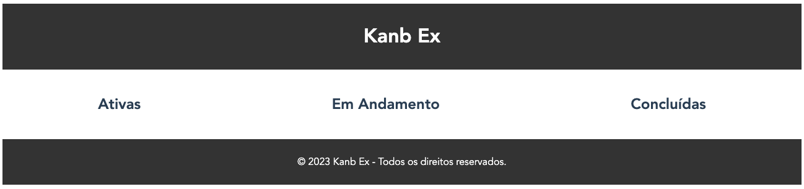

<h1 align="center">
  Kanban Example
</h1>

<p align="center">
  <a href="https://img.shields.io/github/repo-size/Danilo-Js/Kanb-Ex/commits/master">
    
  </a>

  <a href="https://img.shields.io/github/issues/Danilo-Js/Kanb-Ex/issues">
    
  </a>
  
  
  
  
  
  
</p>

<p align="center">
A Kaban-like task management simulator
</p>

<p align="center" direction="row">
  <a href="#rocket-about-the-project">About the project</a>&nbsp;&nbsp;&nbsp;|&nbsp;&nbsp;&nbsp;
  <a href="#wrench-technologies">Technologies</a>&nbsp;&nbsp;&nbsp;|&nbsp;&nbsp;&nbsp;
  <a href="#arrow_down-get-this-project">Get this project</a>&nbsp;&nbsp;&nbsp;|&nbsp;&nbsp;&nbsp;
  <a href="#memo-license">License</a>
</p>

<p align="center">
  
</p>

## :rocket: About The Project
Kanban Example is a web-based application that simulates a Kanban board, an efficient tool for task management and organizational workflow visualization. This project is built using Vue.js and leverages modern JavaScript practices.

This is an academic work presented to the Special Topics in Programming II discipline taught by professor Giuliano Prado as a partial grade requirement for Paper 02 of the 2nd semester of 2023.

## :wrench: Technologies
This project is developed with the following technologies:

- Vue.js
- Vuex for state management
- Vue Router for page navigation
- LocalForage for offline data storage

## :arrow_down: Get This Project

To get this project up and running on your local machine for development and testing purposes, follow these steps:

Clone this repository
```bash
$ git clone https://github.com/Danilo-Js/Kanb-Ex.git
```

Navigate to the project directory
```bash 
$ cd Kanb-Ex
```

Install dependencies
```bash 
$ npm install
```

Serve with hot reload at localhost:8080
```bash 
$ npm run serve
```

## :memo: License
This project is [licensed by MIT](https://github.com/Danilo-Js/Kanb-Ex/blob/master/LICENSE).

---

#### Made by Danilo José Lima de Oliveira and Bernardo Mangaraviti Carrerette
